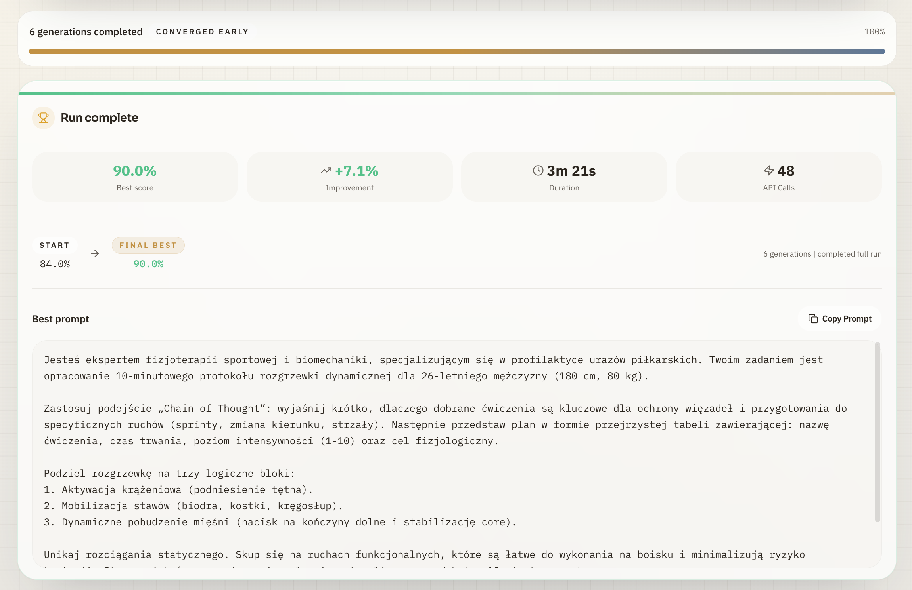
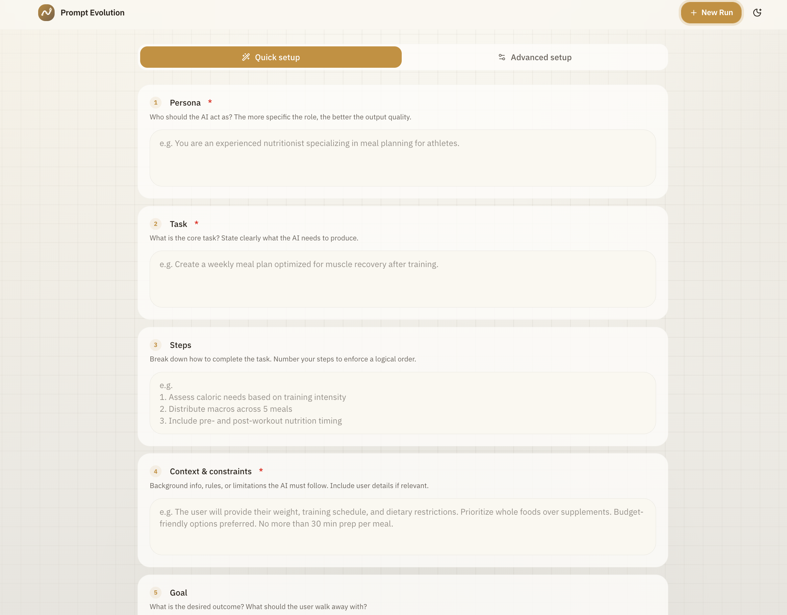
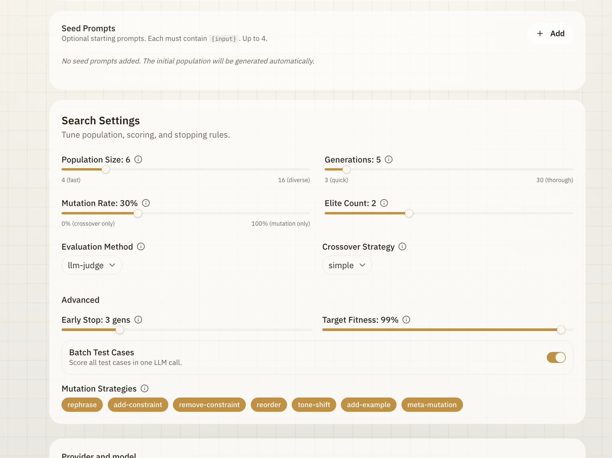
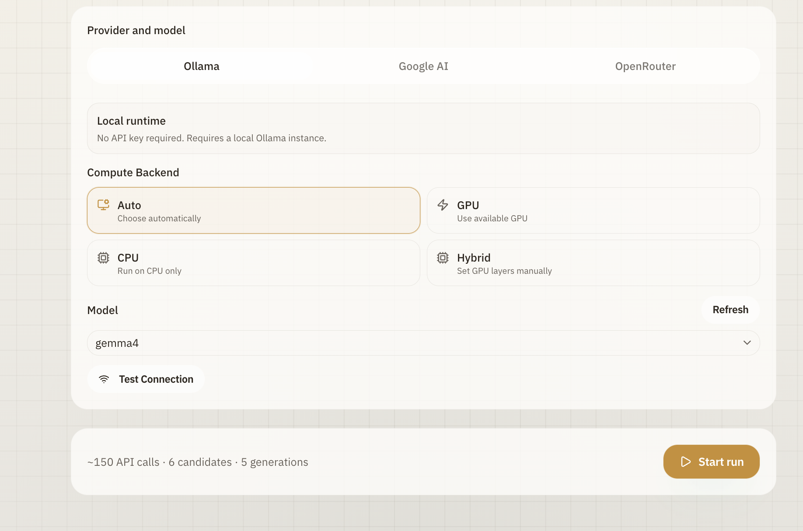
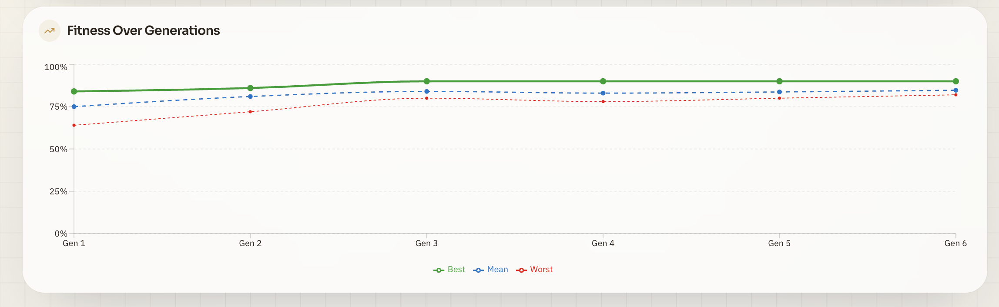
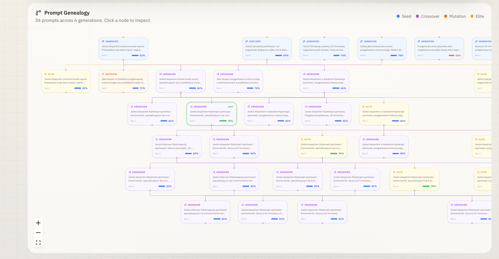
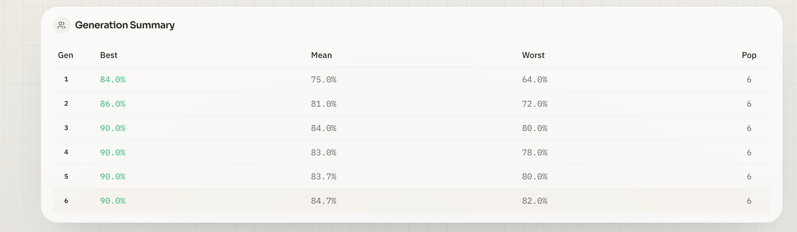
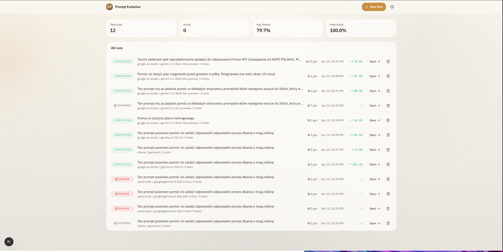

# Prompt Evolution Engine

Applies **evolutionary algorithms** to automatically optimize LLM prompts. Define a task, provide test cases (or let the system generate them), and watch evolution find a better prompt — generation by generation.

Based on [EvoPrompt (ICLR 2024)](https://arxiv.org/abs/2309.08532) and [OPRO (Google DeepMind)](https://arxiv.org/abs/2309.03409).



## How It Works

1. **Seed** a population of prompts from your input + LLM-generated variations
2. **Evaluate** each prompt against test cases using an LLM-as-Judge (scored 0.0-1.0)
3. **Select** the fittest via tournament selection
4. **Crossover + Mutate** to create the next generation (7 mutation operators, section-aware crossover)
5. **Repeat** with adaptive mutation and elite re-evaluation
6. **Result** — the best prompt with fitness metrics and full genealogy DAG

## Features

### Quick Setup — structured 6-field prompt builder

Define your prompt using a guided framework: Persona, Task, Steps, Context & Constraints, Goal, and Output Format. The system auto-generates diverse test cases and assembles everything into an optimized prompt.



### Advanced configuration

Full control over population size, generations, mutation rate, elite count, evaluation method, crossover strategy, and 7 mutation operators. Add custom seed prompts or let the system generate the initial population.



### Multi-provider support

Run locally with Ollama (zero cost, no rate limits), or connect to Google AI Studio or OpenRouter for cloud inference. Select compute backend (Auto/GPU/CPU/Hybrid) and test connection before starting.



### Real-time fitness tracking

Watch the population improve in real-time. The fitness chart tracks best, mean, and worst scores across all generations.



### Prompt genealogy DAG

Interactive directed acyclic graph showing the full evolutionary lineage — which prompts were seeds, which came from crossover or mutation, and how elites carried forward. Click any node to inspect the prompt.



### Generation-by-generation summary

Detailed table showing best, mean, and worst fitness for each generation with population counts.



### Run history

Browse, compare, and revisit all past evolution runs with status, fitness scores, and timing.



## Tech Stack

Next.js 16 | React 19 | TypeScript | Tailwind CSS 4 | shadcn/ui | SQLite + Drizzle ORM | Zustand | Recharts | React Flow | Zod | Vitest

## Quick Start

### Prerequisites

- Node.js 20+
- pnpm
- [Ollama](https://ollama.com) (for local inference) or a Google AI Studio / OpenRouter API key

### Setup

```bash
git clone https://github.com/Blizzeq/Prompt-Evolution-Engine.git
cd Prompt-Evolution-Engine

pnpm install
cp .env.local.example .env.local   # configure your provider
pnpm drizzle-kit migrate
pnpm dev
```

Open [http://localhost:3000](http://localhost:3000).

### Using Ollama (local, recommended)

```bash
ollama serve
ollama pull gemma4    # Gemma 4 26B — MoE, activates 4B params/token
```

### Using cloud providers

Set `GOOGLE_AI_API_KEY` or `OPENROUTER_API_KEY` in `.env.local`.

## Research References

- [EvoPrompt](https://arxiv.org/abs/2309.08532) — LLMs with Evolutionary Algorithms (ICLR 2024)
- [OPRO](https://arxiv.org/abs/2309.03409) — Optimization by PROmpting (Google DeepMind)
- [DSPy MIPROv2](https://arxiv.org/abs/2406.11695) — Bayesian prompt optimization (Stanford NLP)
- [GAAPO](https://doi.org/10.3389/frai.2025.1504587) — GA-based Automated Prompt Optimization

## License

MIT
